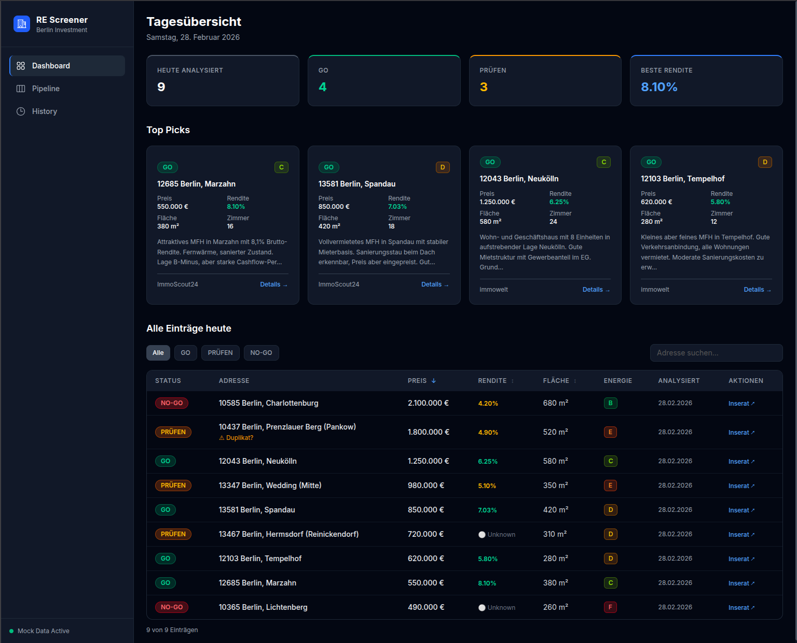

Finding good investment property in Germany is a slow, manual process. You're cross-referencing three or four listing platforms, filtering by your own criteria, calculating yields, and doing all of it again the next morning because new listings appeared overnight. I recently built a system to automate most of this for a client, and I am genuinely proud of the result.

## The Brief

The client needed a way to monitor the real estate market here in Berlin across multiple platforms simultaneously, filter listings against their specific investment criteria, and surface only the most relevant opportunities daily — without spending hours doing it manually. The output needed to be both a persistent dashboard for browsing and a daily email digest so nothing good slipped past.

## The Stack

I built the system by connecting four tools that each do one thing well:

- **Apify** — scraping Immoscout24, Immowelt, and Kleinanzeigen on a scheduled basis
- **n8n** — orchestrating the entire processing pipeline: deduplication, filtering, enrichment, AI analysis, and email dispatch
- **Airtable** — serving as the data store and structured backend
- **Next.js** — the client-facing dashboard, pulling data from Airtable

No single piece of this is novel. The value is in how they fit together, and the rapidity with which they allow the goal to be reached.

## The Pipeline

### Scraping and Ingestion

Apify handles the scraping. Each of the three platforms gets its own actor running on a schedule triggered by n8n, and results land in n8n via an API call. At this stage the data is raw and messy — duplicate listings are common because the same property often appears on multiple platforms, and the field schemas differ drastically between sites and require normalization before anything useful can happen.

The first n8n steps normalize fields into a common schema and deduplicate across sources. Deduplication by listing ID alone doesn't work across platforms, so the logic uses a combination of address, price, and size to catch cross-site duplicates.

### Filtering and Enrichment

Once deduplicated, listings pass through a filter stage based on the client's criteria: price range, size, location, property type, heating, rental status, and energy class. Anything that doesn't fit the client criteria is logged to the Airtable with the reason for its declined status.

Listings that survive filtering get enriched with yield estimates calculated from the asking price and local average rental data. This gives each listing with enough input data available a rough return figure without requiring the client to do that math manually.

### The AI Analysis Step

The filtered and enriched listings are passed to an AI model (in this case Gemini 2.5 Flash for its low usage cost for prototyping) via n8n, along with a prompt derived from the client's investment criteria document. The model evaluates each listing and returns:

- A **status**: `GO`, `NO-GO`, or `PRÜFEN`
- A **risk summary**: a short description of notable concerns
- A **match description**: how well the listing aligns with the client's stated expectations

The three-way classification was a client request and deliberate design choice. Binary GO/NO-GO would be too blunt — a lot of listings are genuinely ambiguous, and forcing them into a binary answer tends to either create false positives or filter out actual opportunities. `PRÜFEN` (German for "examine") is the answer for those in-between cases, and it gives the client a meaningful signal without pretending certainty.

The model's output is written back to Airtable alongside the listing data, so it's visible in the dashboard and queryable.

### Email Digest

At the end of each daily run, n8n compiles the day's `GO` and `PRÜFEN` listings into a formatted email and sends it to the client, along with an additional AI call to evaluate the day's listings and provide 4 recommended listings to consider. The email is the primary touchpoint — the dashboard is for deeper browsing, but the email ensures the client doesn't have to think about checking in. The best opportunities come to them.

## The Dashboard

The Next.js frontend reads from Airtable and presents listings in a filterable table with the AI status prominently displayed. The client can sort by yield, filter by status, and access all data on individual listings to see the full analysis and data collected. Keeping Airtable as the data layer rather than a custom database was a deliberate tradeoff: it meant faster development and gave the client a familiar interface to inspect and annotate the raw data directly if they ever needed to.

## What I'd Do Differently

The n8n workflow grew more complex than I initially planned. What started as a linear pipeline acquired several conditional branches as edge cases emerged — what to do with listings that are missing size data, how to handle Apify and Gemini failures gracefully, how to avoid re-processing listings that had already been analyzed, and how to ensure the quality of the results. It is natural for schema to evolve as a project develops, but if I needed to do this again with what I know now, I would have spent a bit more time with a pen and paper thinking about what exactly needs to be displayed in the end, and what exactly both the client and the software needs from the database.

## Plans for the future

Currently, the dashboard exists [here](https://real-estate-dashboard-brown-seven.vercel.app/), stuffed with mock data and disconnected from Airtable. It wouldn't do to give the whole internet the ability to write to the database! The repository can be found [here](https://github.com/mojoro/real-estate-dashboard) on my [GitHub](https://github.com/mojoro).

Some things I might like to add later on are:
 - Ability to message the agent directly from the dashboard
 - Feature to customize filter and search criteria
 - More sources of listings
 - Pause button for the scheduled runs
 - Preview different outputs from different AI models
 - Run a daily automation to remove listings with dead links from the database
 - and always more and more

Scope is an easy thing to get out of hand, so it is important to cut out the fat and understand what the core features of any software/automation/platform one is building should be. Identify that, implement that, and once all those boxes are ticked, ship that. Once it lives, it can grow.

## What I Took Away From This

It was an enjoyable project to work on, and the timing of the client's needs coincided well with my own goals for the next few months. I took this project as a chance to refine my approach to automations such as these, and as always a learning opportunity to try out some of the new technologies out there while still utilizing the tried-and-true tools that I am familiar with.
